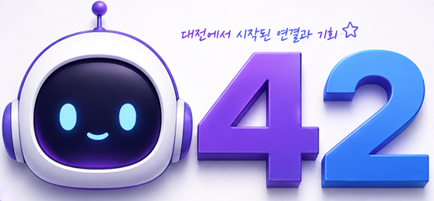

# HUGGIE

접근성

> 
> 
**지역의 번호**

042
---
어르신들과 편안하게 소통하기 위해
## 1. 무엇인지 알아볼래요 (프로젝트 소개)
 **우리가 만난 분들:** 중리종합사회복지관을 이용하시는 우리 동네 어르신들
 **함께 나누고픈 가치:** 예쁜 기억을 오래 보듬는 '치매 인식 개선', 따뜻하게 연결되는 '사회적 소속감'
 **도와드리고 싶은 점:** 눈이 조금 어두워도 길을 잃지 않고 편안하게 이용할 수 있는 따뜻한 웹 환경을 만듭니다.

## 2. 당신의 사용 환경과 경험을 들려주세요 (UI/UX 설계)
어르신들이 화면 에서 헤매지 않고 편안함을 느끼실 수 있도록 터치 화면으로 꾸몄습니다.
- ** ** 여기저기 누르다 길을 잃지 않으시도록, 한 페이지 안에서 설계했습니다.
- **지금 어디 계신지 알려드릴게요 (시각적 위치 인지):** "내가 지금 어디쯤 와 있지?" 불안하시지 않게, 자바스크립트(JS) 스텝퍼가 현재 어르신의 위치를 실시간으로 환하게 불을 켜서 보여줍니다.
- **눈이 침침해도 잘 보여요 (고대비 테마):** 옅은 글씨는 어르신들 눈에 보이지 않습니다. 웹 접근성 표준에 맞춰 글씨가 또렷하게 도드라지는 고대비 테마를 준비했습니다.

## 3. 상태를 직접 움직여볼게요 (기술 스택 및 아키텍처)
보이지 않는 곳에서는 튼튼하고 유연한 프론트엔드 기술이 어르신들의 화면을 지탱하고 있습니다.
- **말랑말랑한 화면 조작:** HTML5, CSS3, 순수 자바스크립트(Vanilla JS)를 활용해 부드럽고 직관적인 화면을 그려냅니다.
- **어르신 맞춤형 기억 저장소 (`userConfig`):** 어르신이 설정한 큰 글씨 모드나 고대비 상태를 JSON 형태의 객체 데이터로 안전하게 기억하고 제어합니다.

## 🔗 4. 우리 함께 만나러 가요 (라이브 데모)
- [실제 반응형 웹 프로필 확인하기](https://keyboardkids.github.io/042/)
